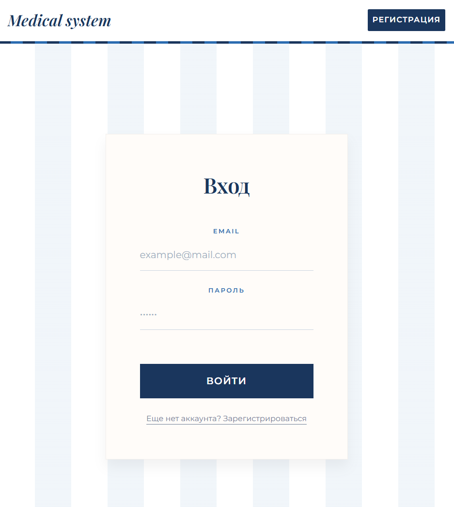

# Medical System

Система управления клиникой, электронными медицинскими картами и записью пациентов.

## Доступный функционал

- Авторизация врача
- Просмотр и редактирование личного кабинета
- Просмотр пациентов с фильтрацией
- Регистрация нового пациента
- Просмотр медицинской карты больного, списка его осмотров
- Просмотр деталей, добавление и редактирование осмотра
- Страница с консультациями, соответствующими специальности авторизованного врача
- Автоматическое формирование отчета по заболеваемости по определенным диагнозам в выбранном временном диапазоне

## Использованные технологии

- **Frontend:** React + Vite
- **Язык:** TypeScript
- **Роутинг** React Router DOM
- **State Management:** TanStack Query (React Query) + Axios
- **Формы:** React Hook Form + Zod
- **Иконки:** Lucide React
- **UI библиотека:** Mantine UI
- **Линтинг:** ESLint + Prettier, Import Sorting, Unused Imports, a11y

## Установка и запуск

Установите зависимости:

```bash
npm install
```

Запустите сервер для разработки:

```bash
npm run dev
```

### Структура проекта

```text
src/
├── api/ # Запросы к API (axios)
├── assets/ # Статические файлы (изображения, шрифты)
├── components/ # Общие UI-компоненты
├── hooks/ # Кастомные React хуки
├── pages/ # Страницы приложения
├── types/ # TypeScript интерфейсы и типы
├── utils/ # Вспомогательные функции
```

## Скриншоты

<table>
  <tr>
    <td width="50%" align="center">
      
      <br />
      <b>Страница входа</b>
    </td>
    <td width="50%" align="center">
      
      <br />
      <b>Реестр пациентов</b>
    </td>
  </tr>
  <tr>
    <td width="50%" align="center">
      
      <br />
      <b>Отчет о заболеваемости</b>
    </td>
    <td width="50%" align="center">
      
      <br />
      <b>Список консультаций</b>
    </td>
  </tr>
</table>
